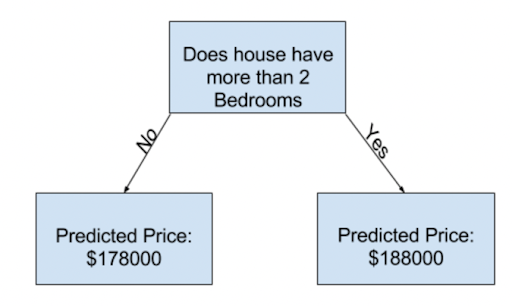

# Введение в машинное обучение

Резюме: Данный проект представляет собой введение в машинное обучение и, в частности, в первичный анализ данных с некоторыми практическими основами.

💡 [Нажмите здесь](https://new.oprosso.net/p/4cb31ec3f47a4596bc758ea1861fb624) **чтобы оставить отзыв о проекте**. Он анонимен и поможет нашей команде сделать ваш учебный опыт лучше. Мы рекомендуем пройти опрос сразу после завершения проекта.

## Содержание

1. [Глава I. Преамбула](#chapter-i-preamble)
2. [Глава II. Введение](#chapter-ii-introduction) \
    2.1. [Шаги по построению модели](#steps-to-build-a-model) \
    2.2. [Алгоритмы машинного обучения](#ml-algorithms) \
        2.2.1. [Обучение с учителем](#supervised-learning) \
        2.2.2. [Обучение без учителя](#unsupervised-learning)
3. [Глава III. Цель](#chapter-iii-goal) 
4. [Глава IV. Инструкции](#chapter-iv-instructions)
5. [Глава V. Задание](#chapter-v-task)

## Глава I. Преамбула

«По мере постоянно растущего объема данных в электронной форме потребность в автоматизированных методах анализа данных продолжает возрастать. Цель машинного обучения — разработать методы, которые могут автоматически обнаруживать закономерности в данных, а затем использовать обнаруженные закономерности для прогнозирования будущих данных или других интересующих результатов» — мы начинаем наш курс с определения машинного обучения из одной из широко известных книг — «Machine Learning: A Probabilistic Perspective» Кевина П. Мерфи. 

Методы машинного обучения решают множество задач:
* Проблема прогнозирования цен на жилье. Мы пытаемся определить стоимость объекта на основе набора признаков, таких как качество ремонта, метраж и площадь.
* Какое заболевание у пациента, если мы наблюдаем определенный набор симптомов?
* Вернет ли клиент банка кредит, если его доход составляет X и у него хорошая кредитная история?
* Какие товары целесообразно показать пользователю на главной странице интернет-магазина, чтобы ускорить его успешный поиск?

В большинстве случаев мы можем ответить на все эти вопросы. Но гораздо лучше иметь машину, которая сможет выполнять эту работу без предвзятости и во много раз быстрее. Данные требуют автоматизированных методов анализа, что и обеспечивает машинное обучение. Мы определяем машинное обучение как набор методов, которые могут автоматически обнаруживать закономерности в данных, а затем использовать обнаруженные закономерности для прогнозирования будущих данных.

Подводя итог, этот курс покажет вам, что такое машинное обучение. После прочтения всех материалов и выполнения лабораторных работ вы освоите все базовые подходы к построению моделей и научитесь предсказывать будущее.

## Глава II. Введение

### Шаги по построению модели

Предположим, вы очень умный продавец жилья. Вы знаете всё о рынке недвижимости (*данные* и *признаки*) и понимаете, как цена зависит от различных факторов (*алгоритм*). Например, вы знаете, что чем больше спален в квартире, тем она дороже. Но как заставить машину научиться таким зависимостям? И как понять, кто предсказывает лучше: очень умный риелтор или машина? 

Сначала вы делите дома на две группы: **обучающие** и **тестовые** данные. Первые используются для определения взаимосвязи между признаками и ценой. Вторые предсказывают цену для новых домов, которых нет в первой группе. Таким образом, **построение модели** — это последовательность методов, которые вы используете для подготовки и анализа данных, поиска связей и последующего прогнозирования новых цен. 

Первый шаг выявления закономерностей в *обучающих* данных называется **подгонкой** (fitting) или **обучением** (training) модели. Данные, используемые для обучения модели, называются **обучающей выборкой**. Все характеристики, на которых вы основываете свое решение, называются **признаками**. Например, количество спален или ванных комнат — это признаки. А цена — это **целевая переменная** (target). Ваш простой алгоритм в приведенном выше случае может быть таким: «Если в доме больше 2 спален, то его цена составляет 188 000 долларов, в противном случае его цена составляет 178 000 долларов».

Подробности того, как *подгонять* модель, достаточно сложны, и мы обсудим их позже. После подгонки модели вы можете применить ее к новым или **тестовым** данным, чтобы **спрогнозировать** цены на новые дома. Это позволит вам понять, насколько хорошо модель работает на невидимых данных, то есть оценить производительность нашей модели. В большинстве (хотя и не во всех) случаях релевантной мерой качества модели является точность прогноза. Другими словами, близки ли предсказания модели к тому, что происходит на самом деле? Позже будет больше теории о метриках.

Следовательно, для построения модели машинного обучения мы выполняем следующие шаги:
1. Собираем обучающие данные;
2. Получаем признаки и целевую переменную;
3. Обучаем (подгоняем) модель;
4. Получаем предсказания для новых признаков из невидимой части данных (тестовых данных);
5. Оцениваем качество модели.

### Алгоритмы машинного обучения

Теперь давайте поговорим о классификации алгоритмов. 
Но сначала давайте посмотрим на определение машинного обучения, данное Томом Митчеллом:

*Говорят, что компьютерная программа обучается на опыте E в отношении некоторого класса задач T и показателя производительности P, если ее производительность при решении задач из T, измеряемая с помощью P, улучшается с опытом E.*

Это определение близко к *опыту E* детей в школе. Время от времени группа детей учит, а затем повторяет таблицу умножения (*задача T*) и получает оценки (*показатель производительности P*) за свои знания. Чем больше раз дети повторяют таблицу умножения, тем лучше становятся их знания и тем лучшие оценки они получают.

Таким образом, существует множество типов машинного обучения, в зависимости от типа задач T, которым мы хотим обучить систему, типа показателя производительности P, который мы используем для оценки системы, и типа обучающего сигнала или опыта E, который мы ей даем. Существует большое разнообразие методов машинного обучения. Приведем несколько примеров.

|  | Задача T | Показатель производительности P | Опыт E |
| ----- | ------ | ------ | ----- |
| 1 | Прогнозирование цены дома | Насколько близко мы находимся к цене | Описание каждого дома в городе с фиксированными характеристиками и ценой |
| 2 | Прогнозирование того, вернет ли клиент кредит | Верно ли наше предсказание или нет    Или сумма денег, потерянная банком, если он выдал кредит, но клиент его не вернул | Зарплаты клиентов и их кредитная история |
| 3 | Прогнозирование того, когда пациенту нужно принять лекарство | Помогает ли лекарство выздороветь | Текущие медицинские записи пациента. Результаты рандомизированного контролируемого испытания этого лекарства. Плюс медицинские записи других пациентов. |
| 4 | Выбор того, какое из доступных лекарств должен принять пациент | Помогает ли лекарство выздороветь | Текущие медицинские записи пациента. Результаты рандомизированных контролируемых испытаний этих лекарств. Плюс медицинские записи других пациентов |
| 5 | Выбор сегмента клиентов для промо-коммуникации | Коэффициент открытий (Open rate) коммуникации    Или увеличение прибыли | Информация о том, какие товары были включены в акцию. История покупок клиентов. Характеристики товаров |
| 6 | Распознавание бракованных товаров на производственной линии (на основе фотосканирования) | Количество пропущенных дефектов | Фотографии бракованных и небракованных товаров |
| 7 | Решение о том, как разместить товары на полке в магазине | Количество проданных товаров    Или увеличение прибыли | История того, как мы размещали товары раньше. Заказы с количеством товаров. |
| 8 | Поиск сайтов по введенному текстовому запросу | Доля успешных поисков    Средний ранг успешного ответа | Поисковые запросы других пользователей. Текстовое описание каждого сайта |
| 9 | Разделение клиентов магазина на сегменты для понимания различий в их поведении | Насколько хорошо вы можете интерпретировать разбиения | Характеристики клиентов и история покупок |
| 10 | Обнаружение аномалий в трафике сайта | Количество предотвращенных DDoS-атак | Поток запросов к вашим серверам |

И эти примеры можно легко продолжить множеством других задач. Более того, мы можем немного изменить входные условия задачи, и это может потребовать совершенно другого решения. 

Например, представьте, что в 5-м примере нам нужно провести акцию для абсолютно новых продуктов нового бренда, которые не имеют истории покупок. Обычно, когда в научной области существует большое разнообразие задач, которые она пытается решить, используется некоторая классификация, чтобы облегчить навигацию по этим задачам. Машинное обучение не исключение. Основная классификация делит его на **обучение с учителем** и **обучение без учителя**.

#### Обучение с учителем 

Обучение с учителем — это когда у вас есть некоторые входные переменные (X) и выходная переменная (y), и вы используете алгоритм для изучения функции отображения от входа к выходу. Проблема прогнозирования цен на жилье является примером обучения с учителем. 

Оно называется обучением с учителем, потому что процесс обучения алгоритма на обучающем наборе данных можно представить как учителя, контролирующего процесс обучения. Мы знаем правильные ответы, алгоритм итеративно делает предсказания на обучающих данных и корректируется учителем. Обучение останавливается, когда алгоритм достигает приемлемого уровня производительности.

Задачи обучения с учителем можно дополнительно разделить на задачи регрессии и классификации.

**Классификация**. В задачах классификации выходное пространство представляет собой набор из _C_ неупорядоченных и взаимоисключающих меток, известных как **классы**, $$Y = \{1,2,...,C\}$$. Задача предсказания метки класса по заданному входу также называется **распознаванием образов**. (Если классов всего два, часто обозначаемых как $$y\in\{0,1\}$$ или $$y\in\{-1, +1\}$$, это называется _бинарной классификацией_.) Задача классификации с множеством классов (более 2) называется _многоклассовой_. Также существует множество задач многометочной классификации.

Например, мы используем _бинарную классификацию_, чтобы ответить на вопрос: есть ли у пациента заболевание сердца? _Многоклассовая классификация_ используется в случаях, когда каждый образец назначается ровно одному и только одному классу: фрукт может быть либо яблоком, либо грушей, либо бананом, но не несколькими одновременно.

**Регрессия**. Предположим, мы хотим предсказать величину с действительными значениями $$y \in \mathbb{R}$$ вместо метки класса $$y \in \{1,...,C\}$$; это называется регрессией. См. пример выше с прогнозированием цены на жилье.

Подумайте, какие случаи из приведенной выше таблицы также могут быть сформулированы как задачи классификации и регрессии. Предоставьте ответ в ноутбуке проекта.

#### Обучение без учителя

При обучении с учителем мы предполагаем, что каждый входной пример _x_ в обучающем наборе имеет связанный с ним набор выходных целевых переменных _y_, и наша цель — изучить отображение входа на выход.

Гораздо более интересная задача — попытаться «осмыслить» данные, в отличие от простого изучения отображения. То есть мы просто получаем наблюдаемые **входы** $$D = \{x_i: i \in \{1, \dots, N\}\}$$ без каких-либо соответствующих **выходов** $$y_i$$. Это называется обучением без учителя. Другими словами, обучение без учителя — это когда у вас есть только входные данные (X) и нет соответствующих выходных переменных.

Задачи обучения без учителя можно дополнительно классифицировать на задачи **кластеризации**, **поиска ассоциаций** и **снижения размерности**.

**Кластеризация**: задача кластеризации — это когда вы хотите обнаружить присущие данным группы, например, сгруппировать клиентов по покупательскому поведению. 

**Ассоциации**: задача обучения правилам ассоциации — это когда вы хотите обнаружить правила, описывающие большие объемы ваших данных, например, люди, которые покупают товар А, также склонны покупать товар B.

**Снижение размерности (или обобщение)**: цель снижения размерности — обнаружить некоторые общие свойства в нашем наборе данных, понимая при этом, какие признаки сильно отличаются. Если у нас слишком много признаков, мы можем использовать эту информацию, чтобы сжать признаки в меньшие наборы без потери важной информации в них. Этот прием очень полезен, когда нам нужно визуализировать наш набор данных, в котором много признаков.

Подумайте, какие случаи из приведенной выше таблицы могут быть сформулированы как задачи кластеризации, поиска ассоциаций и снижения размерности. Предоставьте ответ в решении проекта. Обратите внимание, что на практике граница между классами обучения без учителя не так четка, и иногда все эти задачи комбинируются. Так что не стесняйтесь делиться своим мнением о том, как вы можете использовать эти методы.

Теперь вы знаете основы теории машинного обучения. Следующий шаг — практика.

